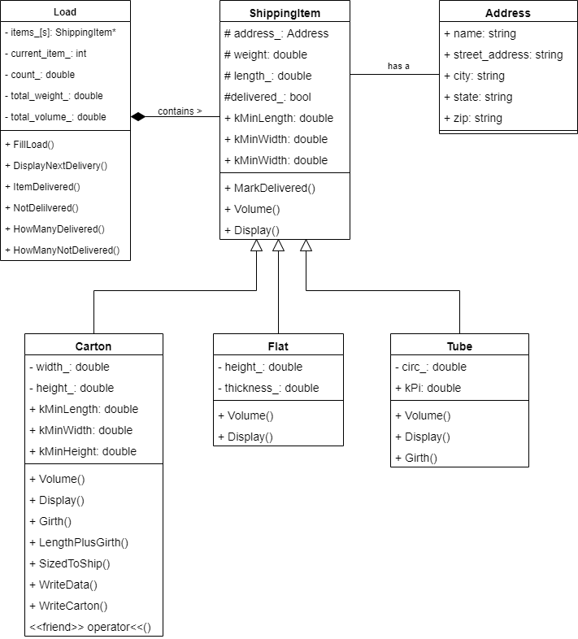
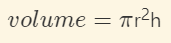
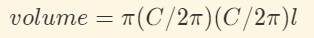

# FINAL PROJECT: THE LOAD CLASS

## Purpose:
This activity works with current topics and pulls together many of 
the programming concepts learned throughout the course. We will 
be using, pointers, dynamic memory allocation, inheritance, and 
polymorphism. These are new topics learned in this unit. We will 
also be working with classes,containers, file I/O, formatting 
output, structures, exceptions, nested classes, static data 
members, and more.

When creating classes that have some things in common and some things that 
are different, inheritance can be very effective. Inheritance allows us to 
only code the common parts once but has the flexibility to allow differences.


## Skills:
This activity will help you practice the following skills that are essential to 
know for basic programming in `C++`:
- Declare and use pointers
- Dynamically allocate memory
- Create an array of pointers
- Manage dynamically allocated memory so there is no memory leak
- Create a base class
- Create subclasses
- Use the keyword virtual to implement polymorphism
- Create an abstract base class
- Create and work with a class that contains nested class objects
- Define and use structures


## Knowledge:
This lab will also help you to become familiar with the following important 
content knowledge in CS:  
  - pointers
  - dynamic memory
  - inheritance
  - polymorphism
  - Source version control
  - Use unit testing to validate code


## Final Project

In this activity we will create a base class, ShippingItem, and three 
subclasses: Carton, Flat, and Tube. Then we will create a Load class that 
manages an entire truckload of shipping items to be delivered.

The testing is set up so you can test each class as you complete it. This 
will provide feedback quicker so you can know everything is working before 
you move on to the next class.

For things to work out well, it is recommended that you complete each part 
in the order listed.

---
### Files to work on
We will be working in the following files.

- There is a library of classes that work with the `load` library. The library 
  consists of the following files:
  - `src/carton.cpp`
  - `src/carton.h`
  - `src/shipping_item.cpp`
  - `src/shipping_item.h`
  - `src/flat.cpp`
  - `src/flat.h`
  - `src/tube.cpp`
  - `src/tube.h`
  - `src/load.cpp`
  - `src/load.h`
- Our "driver" will be `src/main.cpp`.
- To change which classes are tested we will be editing 
the `tests/CMakeLists.txt` file.

Please **DO NOT MODIFY** any other files. Modifying any other file may result 
in the unit tests not passing.

---


In this activity we will be creating several classes. To see how the 
classes are related, consider the following UML class diagram.




---

## Part 1: Create the ShippingItem Class

The `ShippingItem` class will be an abstract base class. 
It will contain all the data and functionality that is 
common to all the different types of shipping items.

Remember to make the details exactly as shown including 
capitalization.

### Part 1.1: Write ShippingItem Class Declaration

1. In the `shipping_item.h` file add a struct named `Address`.
    - Start by adding the include guards for the header file.
    - Add the following data members. Each of these data members is 
    of type string. These will all be public data members which is the 
    default for structs so no access notation is required. 
      - name
      - street_address
      - city
      - state
      - zip

2. Add a declaration for the class named `ShippingItem`.

    - Add four protected data members. These data members will be available 
    to the subclasses.
       - an Address to keep track of who the shipping item is being sent to 
       - a double to keep track of how much the shipping item weighs 
       - a double to keep track of the length of the shipping item
       - a bool to keep track of whether the shipping item has been 
       delivered or not
      
    - add a public section with the following 
      - three static constants of type double
        - kMaxWeight
        - kMaxSize
        - kMinSize
      - two constructors and a destructor
        - ShippingItem();
        - ShippingItem(Address address, double weight, double length);
        - ~ShippingItem(); 
      - four getters
        - Address get_address() const; 
        - double get_weight() const; 
        - double get_length() const; 
        - bool get_delivered() const;
      - four setters
        - void set_address(Address address);
        - void set_weight(double weight);
        - virtual void set_length(double length);
        - void set_delivered(bool delivered); 
      - three other methods    - 
        - void MarkDelivered();
        - virtual double Volume() const;
        - virtual void Display(std::ostream &out) const;

### Part 1.2: Write ShippingItem Class Implementation

3. In the shipping_item.cpp file `include` the shipping_item.h header file.

4. Define the `static data members` and give them the following values. These 
are the values that will be used when validating some of the shipping items. 
The weight limit on packages is 70 lbs. The maximum size (length + girth) 
is 108 inches. The minimum individual size (length, width, height, 
or thickness) is .007 inches.

    - kMaxWeight is 70
    - kMaxSize is 108
    - kMinSize is .007

5. Write the implementation for the `getters`. Each getter returns the value 
of the matching data member.

6. Write the implementation for the `setters`. 

    - The set_address method sets the address to the value sent. There is 
    no validation.
    - The set_weight method sets the weight member to the value sent. If 
    the weight sent is less than 0 or greater 
    than kMaxWeight it throws an out_of_range exception.
    -  The set_length method sets the length member to the value sent. If 
    the length sent is less than kMinSize or greater than kMaxSize it throws 
    an out_of_range exception.
    -  The set_delivered method sets the delivered member to the value sent. 
    There is no validation.

7. Write the `default constructor`. 

    - This method sets the name of the address to 'unknown'. The other 
    members of the address are left unassigned.
    - It sets the weight to 2.
    - It sets the length to 12.
    - It sets delivered to false.

8. Write the `non-default constructor`. Set the data members to the values 
sent. Be sure to use the setters so each value is validated if needed.
9. Write the `destructor`. It does not need to do anything. Just add the { }s

10. Write the `MarkDelivered` method. This method sets the delivered data 
member to true. 
11. The `Volume` method will not be implemented in the ShippingItem class. 
Make this a pure virtual function by setting it to 0. 
12. The `Display` method will not be implemented in the ShippingItem class. 

Make this a pure virtual function by setting it to 0. 
 
Since the ShippingItem class has pure virtual functions we are not able 
to declare any objects of type ShippingItem. We will not be able to do 
any additional testing at this point.  

---

## Part 3: Change the Carton Class so it Inherits From the ShippingItem Class 

Cartons are one type of shipping item. We have worked with the `Carton` class in 
several activities. We will be using it 
again in this activity. This version is a bit different than
 the Carton class we have used in the past. It throws
 out_of_range exceptions when values sent are incorrect. It
 also verifies that the length is longer than the width
 or height. The code
 for this class is provided for you. 

### Part 2.1: Adapt the Carton Class

There are a few things 
that need to be changed to make the Carton class a subclass of 
the ShippingItem class.

1. Add the notation at the top of the Carton class that has it inherit from 
the ShippingItem class. Use public inheritance. Include the shipping_item.h 
header file. 

2. Remove the kMaxSize and kMinSize static const members. These are 
already declared and defined in the ShippingItem class 
so it is not needed here. Remove both the declarations
and the definitions. 
4. Remove the length data member. This is already declared and defined in the 
ShippingItem class so it is not needed here.
    - Also remove the getter for the length data member.
    - Do not remove the setter for the length data 
    member. The length setter for the Carton class does 
    some additional validation so we need to keep it.
5. Add a new constructor. 
    - Use the following declaration:
      - Carton(Address address, double weight, double side1, double side2, 
      double side3);
    - This constructor is to call the base class constructor with the 
    values sent for address, weight, and side1.
    - Then it is to call the set_measurements method with the values sent 
    for side1, side2, and side3. The set_measurements method throws
    an out_of_range exception. Rethrow this exception in the constructor.
6. The Carton class already has a Volume method. There is no change needed 
for this.
7. Implement the Display method.
    - Add a declaration that matches the Display method in the ShippingItem 
    class. This will not need the virtual designation and it will not be 
    set to 0.
    - This method will output the word Carton followed by weight, length, 
    width, and height using :, lbs., and x as shown below.
    ```
    Carton: 41.4 lbs. 31.2 x 8.6 x 8.6
    ```
    - Use setprecision and fixed to display one digit after the decimal place.
    - Be sure to get the details exact including capitalization and spacing. 

### Part 2.2: Use the Carton Class in Main.cpp

Now we can use the Carton class in main. 

1. Create a
Carton object using the new
constructor. When using this constructor, 
use try/catch blocks to handle the exceptions.

2. Use the Carton object to call the getter and
setter methods. Print out the results to see that the
methods are doing what is expected. When calling the setters, 
use try/catch blocks to handle the exceptions.

3. Use the Carton object to call the 
Display method to print to cout and see how it works.

### Part 2.3: Run the unit tests

Run the unit tests for the Carton class.

9. Now run all the tests on the `Carton` and the `Shipping_Item`
class by running
main_test.

10. If any of the tests fail, make changes until all
the unit tests pass.


---

## Part 3: Create the Flat Class 

Flats are shipping items that are like a big envelope. They have three 
dimensions: length, height, and thickness. All sizes must be at 
least .007 (kMinSize) inches. The length can be a maximum of 15 inches. 
The height can be a maximum of 12 inches. The thickness can be a 
maximum of .75 inches.

The Flat class will inherit from the ShippingItems class.

### Part 3.1: Write Flat Class Declaration

1. In the `flat.h` file add a declaration for the class named `Flat`.
    
    - Start by adding the include guards for the header file.
    - Add a declaration for the class `Flat`
    - Add the notation at the top of the Carton class that has it 
    inherit from the ShippingItem class. Use public inheritance.
    - Add two private data members.
       - a double to keep track of the height 
       - a double to keep track of the thickness
      
    - add a public section with the following 
      - two constructors and a destructor
        - Flat();
        - Flat(Address address, double weight, double length, double height, 
        double thickness);
        - ~Flat();
      - two getters
        - double get_height() const;
        - double get_thickness() const;
      - three setters
        - void set_length(double length);
        - void set_height(double height);
        - void set_thickness(double thickness_);
      - two other methods    - 
        - double Volume() const;
        - void Display(std::ostream &out) const;

### Part 3.2: Write Flat Class Implementation

2. In the flat.cpp file `include` the flat.h header file.

3. Write the implementation for the `getters`. Each getter returns the 
value of the matching data member.

4. Write the implementation for the `setters`. 

    -  The set_length method sets the length member to the value sent. If 
    the length sent is less than kMinSize or greater than 15 it throws an 
    out_of_range exception.
    -  The set_height method sets the height member to the value sent. If 
    the height sent is less than kMinSize or greater than 12 it throws an 
    out_of_range exception.
    -  The set_thickness method sets the thickness member to the value 
    sent. If the thickness sent is less than kMinSize or greater than .75 
    it throws an out_of_range exception.

5. Write the `default constructor`. 

    - The following will automatically be set by the ShippingItem default 
    constructor:
      - address name to 'unknown'
      - weight to 2
      - length to 12
      - delivered to false
    - Write the code to set the following:
      - height to 8
      - thickness to .4

6. Write the `non-default constructor`. 

    - This constructor is to call the base class constructor with the values 
    sent for address, weight, and length.
    - Then it is to call the setters in the Flat class to set the length, 
    height, and thickness. Rethrow these exceptions in the constructor.
      
7. Write the `destructor`. It does not need to do anything. Just add the { }s
 
8. Implement the Volume method. The formula for volume of a Flat is 
length * height * thickness.
9. Implement the Display method.
  
    -  This method will output the word Flat followed by weight, length, 
    height, and thickness using :, lbs., and x as shown below.
    ```
    Flat: 1.4 lbs. 11.2 x 7.3 x 0.6
    ```
    - Use setprecision and fixed to display one digit after the decimal place.
    - Be sure to get the details exact including capitalization and spacing.
 
 ### Part 3.3: Use the Flat Class in Main.cpp
 
 Now we can use the Flat class in main. 
 
 1. Create 
 Flat objects using the default and non-default
 constructors. When using the non-constructor, 
 use try/catch blocks to handle the exceptions.
 
 2. Use the Flat objects to call the getter and
 setter methods. Print out the results to see how these
 getters and setters are working. When calling the setters, 
 use try/catch blocks to handle the exceptions.
 
 3. Use the Flat objects to call the 
 Volume and Display methods. Print out the results to 
 see how these methods are working.
  
 
 ### Part 3.4: Run the unit tests
 
 Run the unit tests for the Flat class.
 
 8. In the tests/CMakeLists.txt (there are three CMakeLists.txt 
 files so be sure to get the one in the tests folder) uncomment 
 the line for flat by removing the # at the beginning of the line.
 
     ```
    set(UNIT_TEST_LIST 
      carton
      shipping_item          
      flat             #uncomment to run flat tests
      #tube             #uncomment to run tube tests
      #load             #uncomment to run load tests
      ) 
     ```
    Then click the Reload Changes message at the top of the 
    tests/CMakeLists.txt file.
 
 9. Now run all the tests on the `Flat` class by running
 main_test.
 
 10. If any of the tests fail, make changes until all
 the unit tests pass.
 

---

## Part 4: Create the Tube Class

Tubes are shipping items that are cylindrical. They have 
two dimensions: length and circumference. All sizes 
must be at least .007 (kMinSize) inches. The length 
plus circumference (the girth for Tubes) can be a 
maximum of 108 (kMaxSize) inches. 

The Tube class will inherit from the ShippingItem class.

### Part 4.1: Write Tube Class Declaration

1. In the `tube.h` file add a declaration for the class 
named `Tube`.

    - Start by adding the include guards for the header file.
    - Add a declaration for the class `Tube`
    - Add the notation at the top of the Carton class that has it inherit 
    from the ShippingItem class. Use public inheritance.
    
    - Add one private data member.
       - a double to keep track of the circumference 
      
    - add a public section with the following 
      - one static constant of type double
        - kPi
      - two constructors and a destructor
        - Tube();
        - Tube(Address address, double weight, double length, 
        double circumference);
        - ~Tube();
      - one getter
        - double get_circumference() const;
      - one setter
        - void set_circumference(double circumference);
      - three other methods    
        - double Volume() const;
        - double Girth() const;
        - void Display(std::ostream &out) const;

### Part 4.2: Write Tube Class Implementation

2. In the tube.cpp file `include` the tube.h header file.
3. Define the static data member `kPi` and give it the value of 3.14159. 

4. Write the implementation for the `getter`. The getter returns the value 
of the matching data member.

5. Write the implementation for the `setter`. 

    - The set_circumference method sets the circumference member to the 
    value sent. If the circumference sent is less than kMinSize or if the 
    length + circumference is greater than kMaxSize it throws an 
    out_of_range exception.

6. Write the `default constructor`. 

    - The following will automatically be set by the ShippingItem 
    default constructor:
      - address name to 'unknown'
      - weight to 2
      - length to 12
      - delivered to false
    - Write the code to set the following:
      - circumference to 12

7. Write the `non-default constructor`. 
    
    - This constructor is to call the base class constructor with the 
    values sent for address, weight, and length.
    - Then it is to call the setters in the Tube class to set the circumference.
    The set methods throw out_of_range exceptions. Rethrow thes exceptions 
    in the constructor.
  
8. Write the `destructor`. It does not need to do anything. Just add the { }s
 
9. Implement the Volume method. 
    The formula for volume of a cylinder is
    
       
     
    But we have the circumference instead of the radius. The formula 
    to convert circumference to radius is
    
      

    So the formula for the volume of a Tube using circumference is:

      

    where   
    C - circumference  
    l - length

10.  Implement the Girth method. For a tube, the girth is simply the 
circumference so this method just needs to return the circumference of the Tube.
11. Implement the Display method.
  
  - This method will output the word Tube followed by weight, length, 
  and circumference using :, lbs., and x as shown below.
  ```
  Tube: 3.8 lbs. 28.0 x 7.3 
  ```
  - Use setprecision and fixed to display one digit after the decimal place.
  - Be sure to get the details exact including capitalization and spacing.

 ### Part 4.3: Use the Tube Class in Main.cpp
 
 Now we can use the Tube class in main. 
 
 1. Create 
 Tube objects using the default and non-default
 constructors. When using the non-constructor, 
 use try/catch blocks to handle the exceptions.
 
 2. Use the Tube objects to call the getter and
 setter methods. Print out the results to see how these
 getters and setters are working. When calling the setters, 
 use try/catch blocks to handle the exceptions.
 
 3. Use the Tube objects to call the 
 Volume, Girth and Display methods. Print out the results to 
 see how these methods are working.
  
 
 ### Part 4.4: Run the unit tests
 
 Run the unit tests for the Tube class.
 
 8. In the tests/CMakeLists.txt (there are three CMakeLists.txt 
 files so be sure to get the one in the tests folder) uncomment 
 the line for tube by removing the # at the beginning of the line.
 
     ```
    set(UNIT_TEST_LIST 
      carton
      shipping_item          
      flat             #uncomment to run flat tests
      tube             #uncomment to run tube tests
      #load             #uncomment to run load tests
      ) 
     ```
    Then click the Reload Changes message at the top of the 
    tests/CMakeLists.txt file.
 
 9. Now run all the tests on the `Tube` class by running
 main_test.
 
 10. If any of the tests fail, make changes until all
 the unit tests pass.
 
---

## Part 5: CREATE THE LOAD CLASS 

Now we have a ShippingItem class with three subclasses. 
Now we need to figure out how to deliver these items. 

Each delivery truck that leaves for the day has a load 
of shipping items to be delivered. These items may be 
cartons, flats, or tubes. Each item has an address where 
it will be delivered.

We will create a class that will manage a load of 
shipping items for delivery. The Load class will help 
the driver by displaying each item when it is next to 
be delivered. It will allow the driver to mark when 
the package is delivered or that it could not be delivered.

This Load class will also keep track of how many 
shipping items are to be delivered, what the total 
volume of the items is, and what the total weight is. 

The items will be loaded from a text file and stored 
in a Load object. The items in the file are in the 
order they are to be delivered. The first item will 
be delivered first, then the second item will be 
delivered. This will continue until the last item 
in the file is delivered.

Because the shipping items are of different types 
we will store them in a vector of ShippingItem pointers. 
This will allow us to work with different types of 
ShippingItems. Also, the number of packages in a 
load will be different for each load. Using a vector 
allows it to be whatever size is needed. We will simply 
add an element to the vector for each package in the load.

There are two load files. 
- load_1.txt
- load_small.txt

The load_small.txt file is just five of the shipping 
items from load_1.txt. These files can be used for 
testing your code.

Each item in the file starts with a letter that indicates which type of 
shipping item it is.
- F for flats
- C for cartons
- T for tubes

This is followed by the details for the address. Each 
detail is on its own line.
- name
- street address
- city
- state
- zip

The last line for each shipping item contains the weight and dimensions. 
The dimensions will be different for each type.

- Flats
  - weight
  - length
  - height
  - thickness
- Cartons
  - weight
  - side1
  - side2
  - side3
- Tubes
  - weight
  - length
  - circumference
  
### Part 5.1: Write the Load Class Declaration

1. In the `load.h` file add a declaration for the class named `Load`.

- Start by adding the include guards for the header file.
- Add a declaration for the class `Load`
- Add five private data members.
   - a vector of ShippingItem pointers 
   - an int to keep track of the index of the current item to be delivered  
   This is an internal value so you can implement this differently if you 
   like. All the shipping items are loaded into the Load object at once 
   but they are delivered in order one at a time. This value is to keep 
   track of the item currently being delivered.
   - an int to keep track of how many packages are in the load  
  This value will remain the same whether each package is delivered or 
  not. It is the total of all the packages in the load.
   - a double to keep track of the total weight
   - a double to keep track of the total volume
  
- add a public section with the following 
  - a constructor and a destructor
    - Load();
    - ~Load();
  - three getters
    - int get_count() const;
    - double get_total_volume() const;
    - double get_total_weight() const;
  - no setters  
  All the private data members are determined by the items in the load. 
  Non of them are to be manually changed.
    
  - six other methods    
    - void FillLoad(std::string filename);
    - void DisplayNextDelivery(std::ofstream &out) const;
    - void ItemDelivered();
    - void NotDeliverable();
    - int HowManyDelivered() const;
    - int HowManyNotDelivered() const;

### Part 5.2: Write the Load Class Implementation

2. In the load.cpp file `include` the load.h header file.

3. Write the implementation for the `getters`. The getters return the value 
of the matching data member.

4. Write the `default constructor`. 

    - The default constructor will set the value of the following data 
    members to 0:
      - current item index
      - count
      - total weight
      - total volume

5. Implement the FillLoad method. This method has one parameter. It is 
the filename, including the path from the build folder, of the file that 
has the shipping item data. For example for the load_1.txt file the 
parameter would be "../../load_1.txt".  
   This method is to read the data for each shipping item in the file. 
   For each item it needs to 
   - read the data
   - create an object of the specified type
   - store the pointer to the new object in the vector
   - increment the count
   - add the weight of this item to the total weight
   - add the volume of this item to the total volume

6. Write the `destructor`. In the FillLoad method we create dynamic memory. 
This needs to be deleted in the destructor.  
   In the destructor delete the memory pointed to by each pointer in the vector.
 
7.  Implement the DisplayNextDelivery method. This method has one parameter, 
an ofstream object. This 
parameter specifies the file stream where the output 
will be sent. This method is to output the address and 
the shipping item using the following format:
    ```
    name 
    street address
    city, state zip
    shipping item display
    ```
    For example:
    ```
    Bill Collins
    32 South Main
    Ogden, UT 84408
    Flat: 3.2 lbs. 12.2 x 8.3 x .32
    ```
    Be careful to get the details exact including capitalization, comma, 
    and spacing.
  
8.  Implement the ItemDelivered method. This method sets the is delivered 
value of the current shipping item to true. Then it changes the current 
item to the next item in the vector.
9.  Implement the NotDeliverable method. This method leaves the is delivered 
value of the current item as false. Then it changes the current item to the 
next item in the vector.
10. Implement the HowManyDelivered method. This method loops through the 
shipping items and returns how many have is delivered set to true.
11. Implement the HowManyNotDelivered method. This method loops through 
the shipping items and returns how many have is delivered set to false.


 ### Part 5.3: Use the Load Class in Main.cpp
 
 Now we can use the Load class in main. 
 
 1. Create a Load object.
 
 2. Use the Load object to call the getter 
  methods. Print out the results to see how these
 getters are working. Do this right after the Load
  object is created and after it is filled from the 
  file.
 
 3. Use the Load object to call the 
 FillLoad method. Then call the DisplayNextDelivery,
 ItemDelivered, NotDeliverable, HowManyDelivered, and
 HowManyNotDelivered methods multiple times to see
 how these work when making deliveries.
  
 
 ### Part 5.4: Run the unit tests
 
 Run the unit tests for the Load class.
 
 8. In the tests/CMakeLists.txt (there are three CMakeLists.txt 
 files so be sure to get the one in the tests folder) uncomment 
 the line for load by removing the # at the 
 beginning of the line.
 
     ```
    set(UNIT_TEST_LIST 
      carton
      shipping_item          
      flat             #uncomment to run flat tests
      tube             #uncomment to run tube tests
      load             #uncomment to run load tests
      ) 
     ```
    Then click the Reload Changes message at the top of the 
    tests/CMakeLists.txt file.
 
 9. Now run all the tests on the `Load` class by running
 main_test.
 
 10. If any of the tests fail, make changes until all
 the unit tests pass.
 
---
# Note

The following code was written by me, Noah Wenzel:

+ All code in the src file


The following code was provided to me:

+ All code in the tests file

